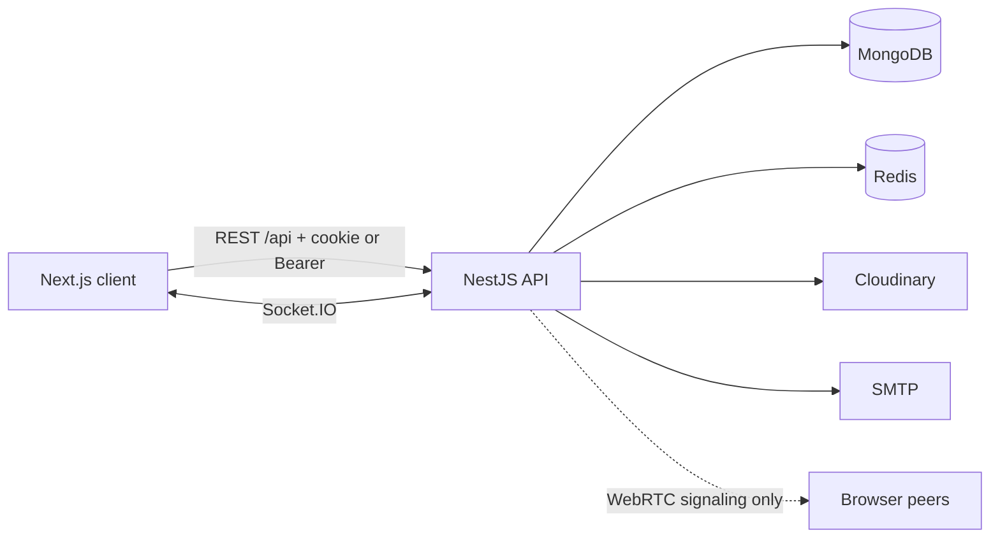

# ChatWave API

**Real-time messaging backend for a WhatsApp-style chat product.**

[](https://nestjs.com)
[](https://www.typescriptlang.org)
[](https://www.mongodb.com)
[](https://redis.io)
[](https://socket.io)
[](https://nodejs.org)

Live API: [chatwave-backend-z7n1.onrender.com](https://chatwave-backend-z7n1.onrender.com)  
Live app: [chatwave-pvj.vercel.app](https://chatwave-pvj.vercel.app) · [chatwave-frontend-alpha.vercel.app](https://chatwave-frontend-alpha.vercel.app)  
Health: `GET /` → `{ "message": "Welcome to Chatwave API", "status": "running" }`  
Frontend talks to this service over REST (`/api`) and Socket.IO (`/socket.io`). CORS allows both Vercel origins (no trailing slash, no `/sign-in` path).

---

## What is ChatWave?

ChatWave is a **full-stack chat application**. This repository is the **backend**: a NestJS API that stores users and conversations, authenticates sessions, and pushes live events (messages, typing, calls, presence).

People use it the way they use WhatsApp or Telegram:

- Find someone, follow them, and start a 1:1 chat
- Talk in groups with admins and membership
- Send text, photos, PDFs, docs, and video from their device
- See when a message was delivered or read
- Place audio/video calls over WebRTC
- Mute, block, pin, and manage devices

**Why this backend exists:** a chat UI is only as good as the server. ChatWave’s API is built so a Next.js client can stay thin: the server owns auth, privacy, receipts, media, and realtime fan-out.

---

## Why recruiters / users care

| Need | What ChatWave does |
| --- | --- |
| Talk instantly | Socket.IO rooms for threads, users, and calls — not polling |
| Stay signed in safely | HttpOnly session cookie + short-lived JWT, Redis-backed devices, logout-all |
| Discover people | Directory of every registered user with Follow / Unfollow; follow opens a DM |
| Share work, not only chat | Multi-file uploads (PDF, Office, images, video) and https document links |
| Privacy | Blocks, read-receipts toggle, delete-for-me vs delete-for-everyone, last-seen settings |
| Calls without a media server | Nest is **signaling only**; media is peer-to-peer WebRTC (STUN, optional TURN) |
| Operate it | Owner admin (ban / unban / delete), notifications, hourly email digest, Render-ready |

Skills this project demonstrates: **REST + WebSockets**, **OAuth 2.0**, **JWT + cookie sessions**, **MongoDB modeling**, **Redis**, **file pipelines**, **WebRTC signaling**, **RBAC**, **production deploy**.

---

## Key features

### Accounts
- Email + password register / login
- Google and GitHub OAuth
- Forgot-password OTP in Redis, reset over SMTP
- Profile, username, photo (Cloudinary), presence (`online` / `away` / `offline`)
- Multi-device session list and revoke

### People
- `GET /api/users` and `GET /api/contacts` — all discoverable users (not you, not blocked)
- Each row has `following` so the UI can show **Follow** or **Unfollow**
- Follow = save contact + open a direct conversation (shows in the chat list)
- Unfollow hides an empty DM; a thread with messages stays until you delete the chat
- Blocks hide people from search, contacts, and 1:1 messaging

### Conversations & groups
- Direct chats and groups (create with at least 3 other members)
- Pin, mute, archive, unread counts, mark read
- Group admins: add / remove members, promote, leave (last admin is auto-promoted)

### Messages
- Text, images, generic files, voice, video (including files from the user’s machine), video notes
- Up to **10 attachments** per send; **50 MB** per file (images **10 MB**)
- Google Docs / Sheets (or any `https`) links as attachments
- Reply, emoji reactions, pin, search, delivered / seen
- `seenBy` list on each message (respects `readReceipts`)
- Delete `scope=me` (any member, hide for yourself) or `scope=everyone` (sender only)

### Calls
- Audio / video 1:1 and group mesh in the call room
- Incoming ring, accept / decline / miss timeout, ICE quality hints
- SDP and ICE candidates are **not stored** — forwarded over the socket

### Product extras
- In-app notifications + unread badge
- Settings: theme, sounds, privacy, delete-account flow
- Owner admin for other accounts (cannot moderate the owner)

---

## Tech stack

| Layer | Choice |
| --- | --- |
| Runtime | Node.js 22 |
| Framework | NestJS 11 (modules, guards, pipes, WebSockets) |
| Language | TypeScript |
| HTTP | Express, Helmet, CORS + credentials, cookie-parser |
| Database | MongoDB (Mongoose) — users, chats, messages, calls |
| Cache / sessions | Redis (ioredis) — sessions, OTPs, live presence, rate limits |
| Realtime | Socket.IO |
| Auth | Passport (local, Google, GitHub), JWT, bcrypt |
| Media | Cloudinary (avatars + chat files) |
| Mail | Nodemailer (reset + digest) |
| Validation | class-validator / class-transformer, env via Joi |
| Tests | Jest |
| Deploy | Render (`node dist/main`), MongoDB Atlas, Redis Cloud |



---

## Architecture

Flat Nest modules (no extra `dto/` / `schemas/` folders):

`Auth` · `Users` · `Conversations` · `Messages` · `Groups` · `Calls` · `Contacts` · `Blocks` · `Sessions` · `Settings` · `Admin` · `Notifications`

Cross-cutting: `RedisModule`, `MailModule`, `CloudinaryModule`, global `ValidationPipe`, `{ "error": "human message" }` filter.

| Concern | Where it lives |
| --- | --- |
| Passwords, sessions, OTPs, presence | Redis |
| Users, DMs, groups, messages, calls | MongoDB |
| Uploads | Cloudinary (`raw` / `image` / `video`) |
| Errors | `{ "error": "…" }` — no stack traces to the client |

---

## Quick start

```bash
pnpm install
cp .env.example .env
```

MongoDB and Redis are required. SMTP, Cloudinary, Google, and GitHub can stay empty while you develop.

**MongoDB** (Atlas `MONGODB_URI`, or local):

```bash
docker run -d --name chatwave-mongo -p 27017:27017 mongo:7
```

```
MONGODB_URI=mongodb://127.0.0.1:27017
DB_NAME=chatwave-db
```

**Redis:**

```bash
docker run -d --name chatwave-redis -p 6379:6379 redis:7
```

```
REDIS_URL=redis://127.0.0.1:6379
```

TLS Redis: `REDIS_TLS=true`.

```bash
pnpm start:dev
```

Server: `http://0.0.0.0:$PORT` (`.env.example` uses `5000`). Prefix `/api` except `GET /`.

```bash
pnpm test
```

---

## API map

Auth is the `cw_session` cookie **or** `Authorization: Bearer <accessToken>`.

| Area | Examples |
| --- | --- |
| Auth | `POST /api/auth/register` · `login` · `logout` · `forgot-password` · OAuth `/google` `/github` |
| Users | `GET /api/users` (directory + `following`) · `GET/PATCH /api/users/me` · `GET /api/users/search` |
| Contacts | `GET /api/contacts` · `GET /api/contacts/following` · `POST /api/contacts/:id/follow` · `DELETE /api/contacts/:id` |
| Chats | `GET /api/conversations` · `POST /api/conversations/direct` · `POST /api/conversations/groups` |
| Groups | `POST/DELETE /api/conversations/:id/members` · `POST .../leave` |
| Messages | `GET/POST .../messages` · `POST .../seen` · `DELETE /api/messages/:id?scope=me\|everyone` |
| Calls | `POST /api/calls` · `accept` · `decline` · `end` |
| Blocks / settings / admin / notifications | `/api/blocks` · `/api/settings` · `/api/admin/users` · `/api/notifications` |

### Auth

```bash
curl -s -X POST http://localhost:5000/api/auth/register \
  -H 'Content-Type: application/json' \
  -d '{"name":"Ayesha Rahman","email":"ayesha@example.com","password":"password1"}'

curl -s -c cookies.txt -X POST http://localhost:5000/api/auth/login \
  -H 'Content-Type: application/json' \
  -d '{"email":"ayesha@example.com","password":"password1"}'

curl -s -b cookies.txt http://localhost:5000/api/auth/me
```

### People directory (Follow / Unfollow)

Any signed-in user sees **everyone** except self and blocked accounts. Follow saves a contact and opens a DM.

```bash
curl -s -b cookies.txt 'http://localhost:5000/api/users'
curl -s -b cookies.txt -X POST http://localhost:5000/api/contacts/USER_ID/follow
curl -s -b cookies.txt -X DELETE http://localhost:5000/api/contacts/USER_ID
curl -s -b cookies.txt http://localhost:5000/api/conversations
```

### Messages & files

```bash
curl -s -b cookies.txt -X POST http://localhost:5000/api/conversations/CONVERSATION_ID/messages \
  -H 'Content-Type: application/json' \
  -d '{"type":"text","text":"the waveform looks good"}'

curl -s -b cookies.txt -X POST http://localhost:5000/api/conversations/CONVERSATION_ID/messages \
  -F 'type=file' \
  -F 'caption=specs and clip' \
  -F 'files=@notes.pdf' \
  -F 'files=@demo.mp4' \
  -F 'links=["https://docs.google.com/document/d/abc"]'
```

Response includes `attachments[]` (`kind`: `image` | `video` | `file` | `link`). `mediaUrl` is the first file for older clients.

```bash
curl -s -b cookies.txt -X DELETE 'http://localhost:5000/api/messages/MESSAGE_ID?scope=me'
curl -s -b cookies.txt -X DELETE 'http://localhost:5000/api/messages/MESSAGE_ID?scope=everyone'
```

### More endpoints

Forgot / reset password, profile, presence, blocks, groups, calls, settings, admin, and notifications — copy-paste curls live in the sections below.

<details>
<summary>Auth, users, contacts, blocks, settings, admin, notifications</summary>

```bash
# password reset always returns { "ok": true }
curl -s -X POST http://localhost:5000/api/auth/forgot-password \
  -H 'Content-Type: application/json' \
  -d '{"email":"ayesha@example.com"}'

curl -s -b cookies.txt http://localhost:5000/api/auth/sessions
curl -s -b cookies.txt -X PATCH http://localhost:5000/api/users/me \
  -H 'Content-Type: application/json' \
  -d '{"name":"Md Parvej","username":"parvej","role":"Full-stack developer","location":"Dhaka","tone":"a"}'

curl -s -b cookies.txt http://localhost:5000/api/contacts/following
curl -s -b cookies.txt http://localhost:5000/api/blocks
curl -s -b cookies.txt http://localhost:5000/api/settings
curl -s -b cookies.txt http://localhost:5000/api/admin/users
curl -s -b cookies.txt http://localhost:5000/api/notifications
```

Owner-only admin: non-owners get `403` `This area is only for the owner.`

</details>

<details>
<summary>Conversations, groups, calls</summary>

```bash
curl -s -b cookies.txt 'http://localhost:5000/api/conversations?filter=all&limit=50'
curl -s -b cookies.txt -X POST http://localhost:5000/api/conversations/direct \
  -H 'Content-Type: application/json' \
  -d '{"userId":"64a000000000000000000002"}'

curl -s -b cookies.txt -X POST http://localhost:5000/api/conversations/groups \
  -H 'Content-Type: application/json' \
  -d '{"name":"Frontend Guild","memberIds":["ID2","ID3","ID4"]}'

curl -s -b cookies.txt -X POST http://localhost:5000/api/calls \
  -H 'Content-Type: application/json' \
  -d '{"conversationId":"CONVERSATION_ID","type":"video"}'
```

Group create requires **3 other people**. Calls: one ringing/active call per user (`409 Already in a call`). Ring timeout `CALL_RING_TIMEOUT_MS` (default 35s) → missed.

</details>

---

## Socket.IO

Same host as HTTP, path `/socket.io`. CORS origin = `FRONTEND_URL`. Auth: `cw_session` **or** `handshake.auth.token` / `Authorization: Bearer`.

```ts
import { io } from "socket.io-client"

const socket = io(process.env.NEXT_PUBLIC_SOCKET_URL, {
  withCredentials: true,
  auth: { token },
})

socket.emit("conversation:join", { conversationId })
socket.on("message:new", handler)
```

Rooms: `conversation:{id}` (open thread), `user:{id}` (sidebar / incoming ring), `call:{id}` after `call:join`. Upload media with REST; the server broadcasts `message:new`. Text can go REST or `message:send`.

| Client emit | Server emit |
| --- | --- |
| `conversation:join` / `leave` | `conversation:joined`, `conversation:preview`, `conversation:removed` |
| `message:send` | `message:new`, ACK `{ ok, message, clientId }` |
| `typing:start` / `stop` | `typing` |
| `message:delivered` / `seen` | `receipts:updated` |
| | `message:updated`, `message:deleted` `{ scope: "me" \| "everyone" }` |
| `call:join` / `leave`, `webrtc:offer` / `answer` / `ice` | `call:incoming`, `call:ended`, forwarded SDP/ICE |
| | `notification:new`, `notification:badge`, `user:blocked`, `auth:banned` |

REST message DTOs include `dir` (`in` \| `out`). Socket payloads use `senderId` instead of `dir`.

---

## Environment

See `.env.example`: `PORT`, `FRONTEND_URL`, `API_URL`, Mongo, Redis, `JWT_SECRET`, `SESSION_SECRET`, Google, GitHub, SMTP, Cloudinary, `STUN_URL`, optional TURN, `CALL_RING_TIMEOUT_MS`.

Cross-site cookies (e.g. Vercel frontend + Render API): `SameSite=None; Secure` when origins differ in production.

---

## Deploy (Render)

Do **not** start with `nest start` on a small instance (it recompiles and OOMs).

| | |
| --- | --- |
| Build | `pnpm install --frozen-lockfile --prod=false && pnpm run build` |
| Start | `pnpm start` (`node dist/main`) |
| Health | `/` |
| Node | 22 |

Set `NODE_ENV=production`, `FRONTEND_URL=https://chatwave-pvj.vercel.app` (no trailing slash; CORS also allows `https://chatwave-frontend-alpha.vercel.app`), `API_URL`, `MONGODB_URI`, `REDIS_URL` (`REDIS_TLS` if needed), secrets. Atlas network: `0.0.0.0/0` or Render egress IPs. Nest binds a port only after Mongo connects.

OAuth callbacks: `{API_URL}/api/auth/google/callback` and `{API_URL}/api/auth/github/callback`.

---

## Author

**Md Parvej** — full-stack developer. ChatWave is a portfolio project: production-shaped chat backend (auth, realtime, media, calls, moderation).

- GitHub: [parvejme24/chatwave-backend](https://github.com/parvejme24/chatwave-backend)
- Live API: [chatwave-backend-z7n1.onrender.com](https://chatwave-backend-z7n1.onrender.com)
- Live app: [chatwave-pvj.vercel.app](https://chatwave-pvj.vercel.app) · [chatwave-frontend-alpha.vercel.app](https://chatwave-frontend-alpha.vercel.app)

---

## License

Private / unlicensed coursework-style portfolio code unless you add a license file.
